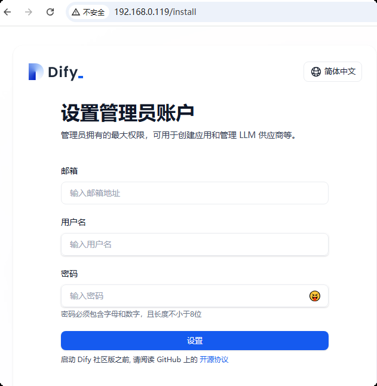
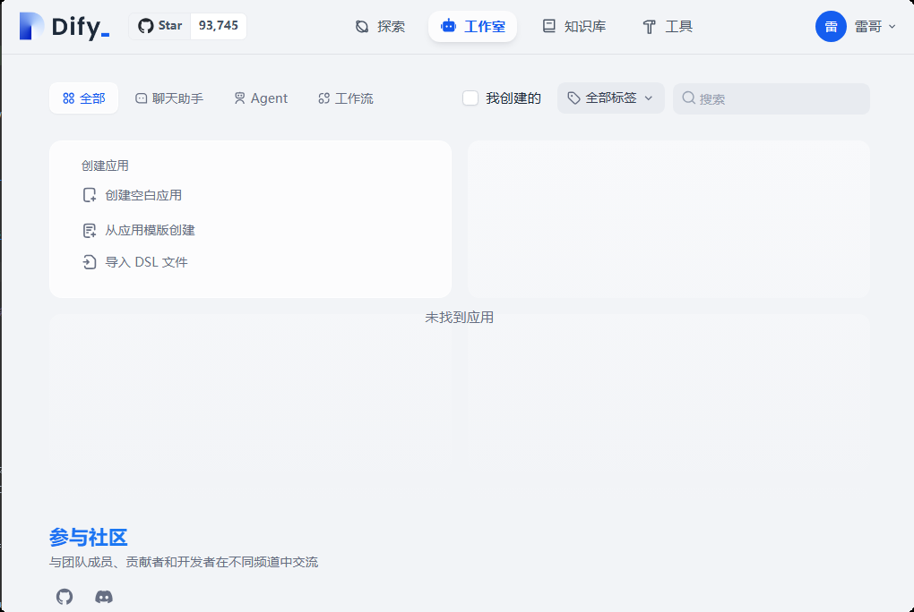
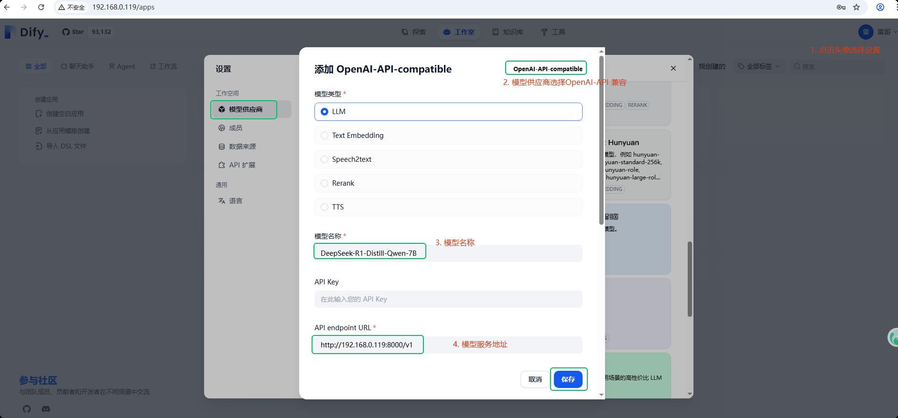
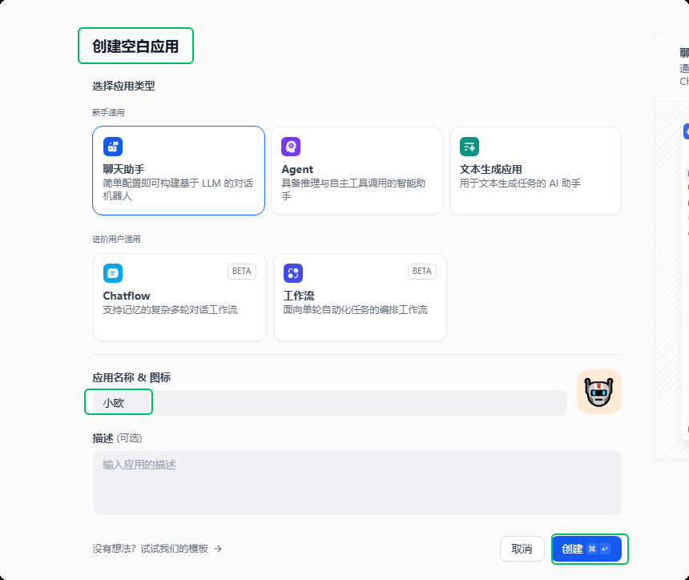
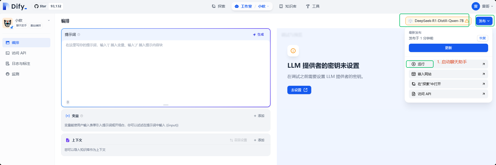
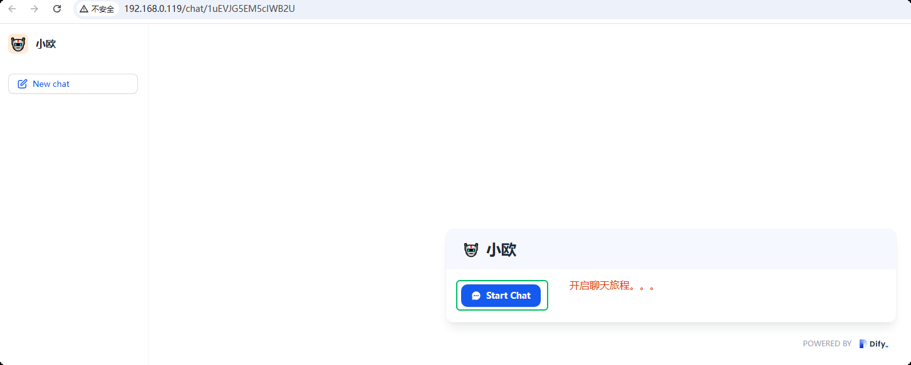

# 管理服务
AI应用平台Dify和DeepSeek-R1-Distill-Qwen-7B推理服务都是开机启动的。

## DeepSeek-R1-Distill-Qwen-7B 服务
```shell
# 重启
systemctl restart deepseek

# 停止
systemctl stop deepseek

```

## 服务运行日志保存在：  **/logs/ds.log** 

## 验证服务
```shell
cd ~
./verify_ds.sh
```
运行成功后生成文件：  **~/verify_ds.log**

# Dify平台应用开发

## 系统初始化
<br>通过链接： **http://your_server_ip/install**  访问Dify，设置管理员账号后登录进入平台。



## 接入部署的DeepSeek模型推理服务



## 创建第一个AI应用聊天助手，体验模型服务



## 发布聊天助手


# 其他
1. Dify其他开发内容参考
<br>[Dify手册](https://docs.dify.ai/zh-hans/guides/application-orchestrate/creating-an-application)