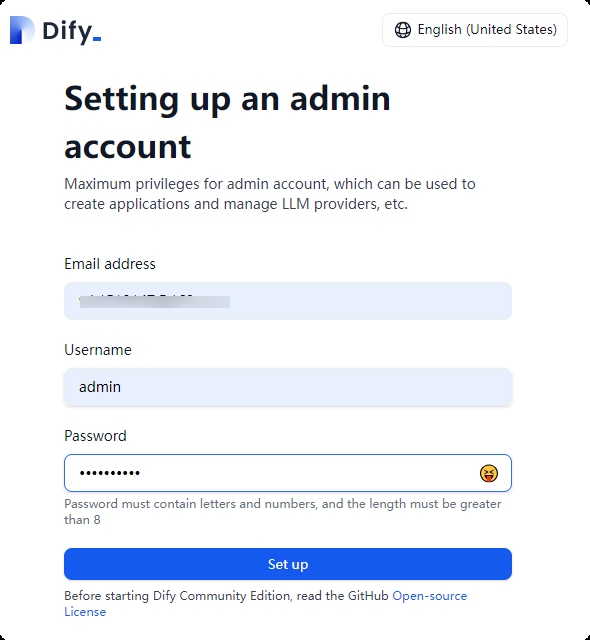
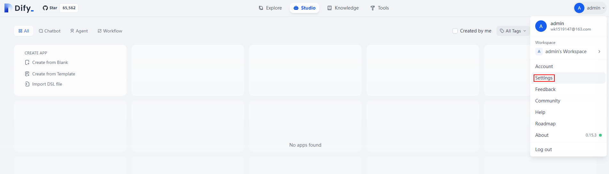
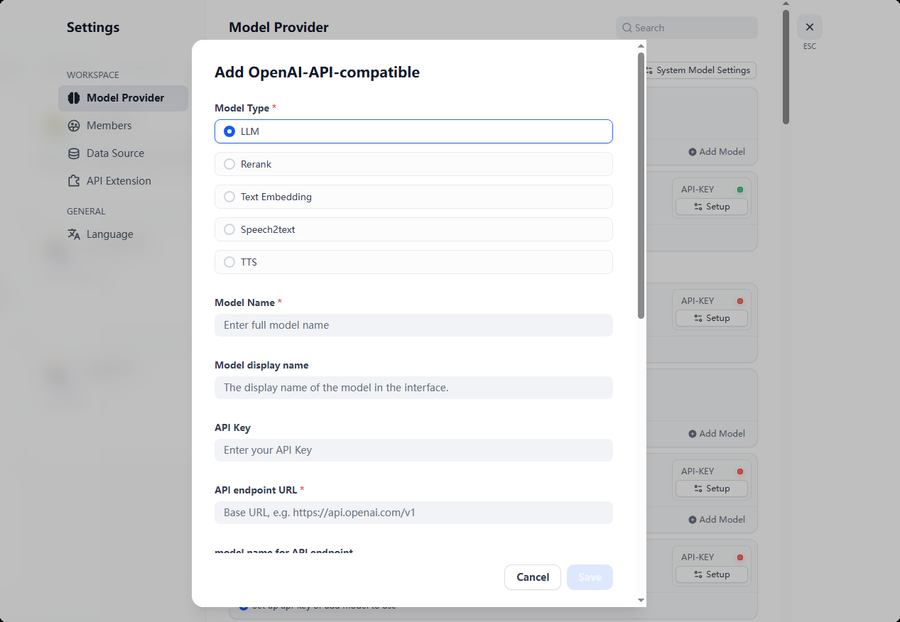
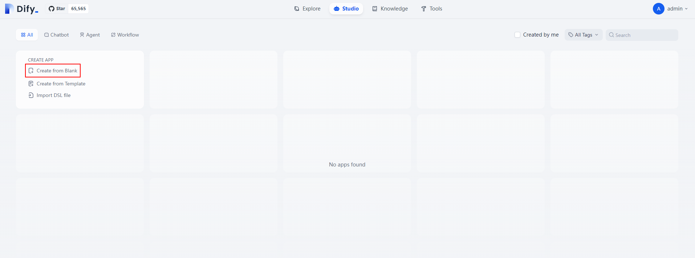
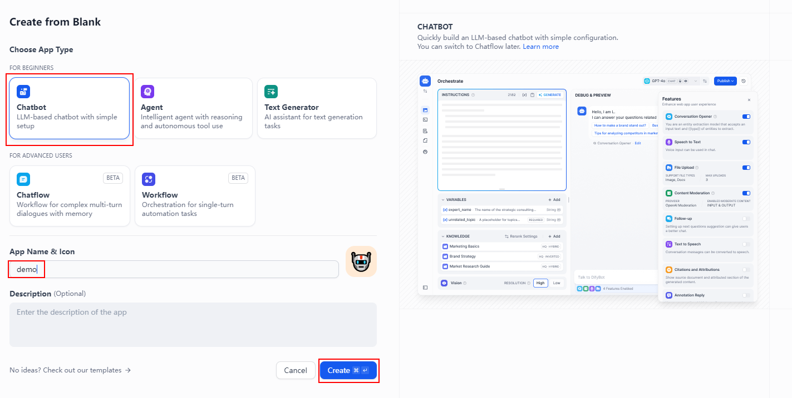

# Managing Services
Both the Dify AI application platform and the DeepSeek-R1-Distill-Qwen-7B inference service are set to start on boot.

## DeepSeek-R1-Distill-Qwen-7B Service
```shell
# Restart
systemctl restart deepseek

# Stop
systemctl stop deepseek
```

## Service Logs are Stored in: **/logs/ds.log**

## Verifying the Service
```shell
cd ~
./verify_ds.sh
```
Upon successful execution, a file named **~/verify_ds.log** will be generated.

# Dify Platform Application Development

## System Initialization
Access Dify via the link: **http://your_server_ip/install**. Set up the administrator account, then log in to the platform.




## Connecting to the Deployed DeepSeek Model Inference Service


## Creating the First AI Application Chat Assistant to Experience the Model Service




# Others
1. For additional Dify development content, refer to the
<br>[Dify Manual](https://docs.dify.ai/zh-hans/guides/application-orchestrate/creating-an-application)